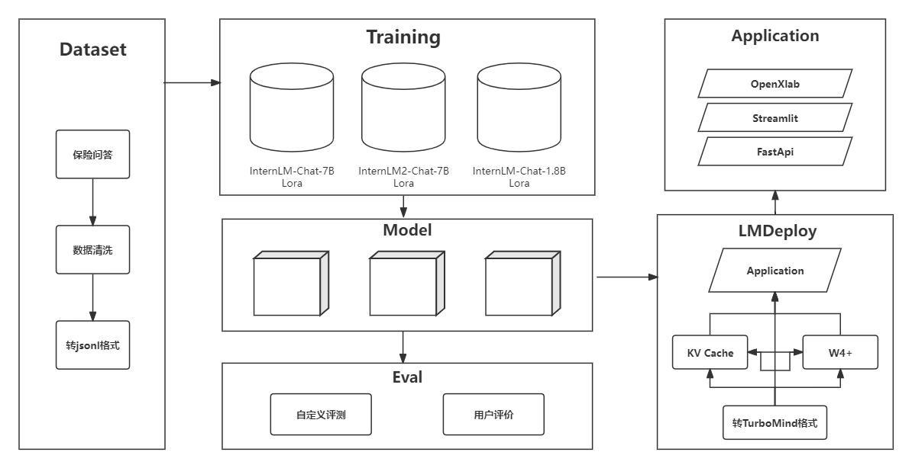

# 古诗词创作助手 :blush:	

## 介绍 😊

​	欢迎使用我们的古诗词创作助手大语言模型！这个模型是基于`CCPM (Chinese Classical Poetry Matching)`提供的丰富中国古代诗词数据集开发而成。我们的数据集是一个大型的中国古典诗歌匹配数据集，可用于诗歌匹配、理解和翻译。

​	我们的模型是您创作古典诗歌的小助手，具备丰富的古典诗歌知识和意象识别、诗歌翻译能力。无论您是想了解一首诗歌的写作背景、情感表达，甚至需要创作一首属于您的诗歌，我们都能为您提供帮助。



## OpenXlab 模型

古诗词创作助手使用的是InternLM 的 7B 模型，模型参数量为 7B，模型已上传，可以直接下载推理。

| 基座模型         | 微调数据量          | 训练次数 | 下载地址 |
| ---------------- | ------------------- | -------- | -------- |
| InternLM-chat-7b | 27218 conversations | 5 epochs |          |

## 数据集

​	古诗词创作助手数据集采用中的`CCPM (Chinese Classical Poetry Matching)`是一个大型的中国古典诗歌匹配数据集，可用于诗歌匹配、理解和翻译，共计 27218个实例，数据集样例：

```
"input": "侍奉夫主，不能尽自己的天年。"
"output": "事主不尽年"
"input": "为王事奔波路程尚没有走尽。"
"output": "王程应未尽"
```

### 数据处理与整理

1. 数据集是以CSV格式存储的，第一行为列名，分别为 `title`, `reply`, `is_best`。
2. 数据集把数据分类为优质回答（is_best=1）与劣质回答（is_best=0），需要过滤掉 `is_best` 列为0的数据。

使用如下脚本文件


# 指定输入的CSV文件和输出的JSON文件

# 调用函数进行转换


```

## 微调

  使用 `XTuner `训练， `XTuner `有各个模型的一键训练脚本，很方便。且对` InternLM2 `的支持度最高。

### XTuner

  使用 `XTuner` 进行微调，具体脚本可参考`configs`文件夹下的脚本，脚本内有较为详细的注释。

| 基座模型         | 配置文件                               |
| ---------------- | -------------------------------------- |
| internlm-chat-7b | internlm_chat_7b_qlora_medqa2019_e3.py |

微调方法如下:

1. 根据基座模型复制上面的配置文件，将模型地址`pretrained_model_name_or_path`和数据集地址`data_path`修改成自己的

```
conda activate xtuner0.1.9
cd ~/ft-medqa
xtuner train  internlm_chat_7b_qlora_medqa2019_e3.py --deepspeed deepspeed_zero2
```

2. 将得到的 PTH 模型转换为 HuggingFace 模型

```
internlm_chat_7b_qlora_medqa2019_e3
xtuner convert pth_to_hf ./internlm_chat_7b_qlora_medqa2019_e3.py ./work_dirs/internlm_chat_7b_qlora_medqa2019_e3/epoch_1.pth ./hf
xtuner convert merge ./internlm-chat-7b ./hf ./merged --max-shard-size 2GB
```

### Chat

```

```

## 本地网页部署

```

```

效果演示


## OpenXLab 部署 古诗词创作助手


## LmDeploy部署


## Lmdeploy&opencompass 量化以及量化评测


### `KV Cache`量化


### `W4A16`量化


## OpenCompass 评测

