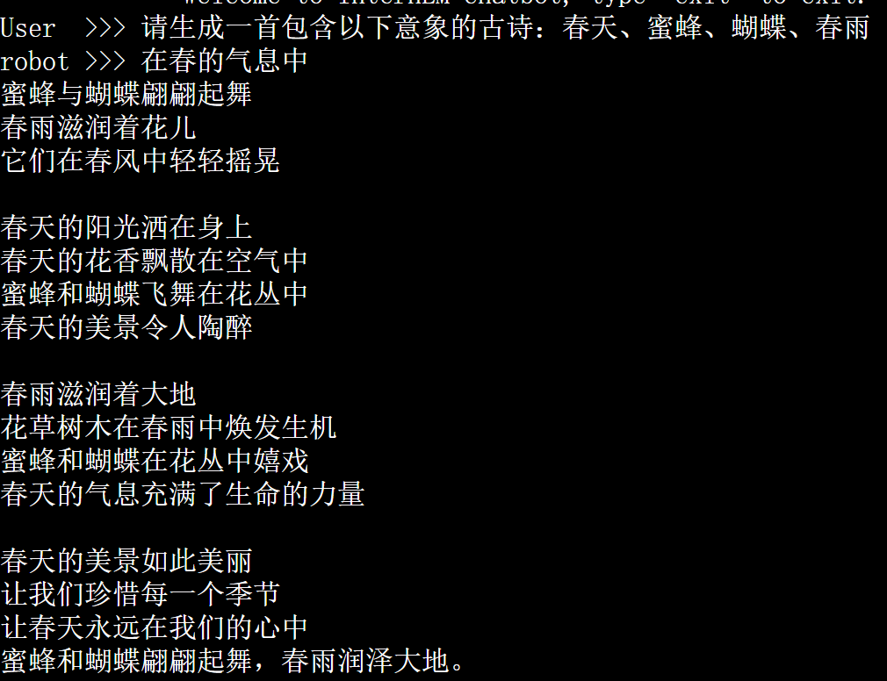
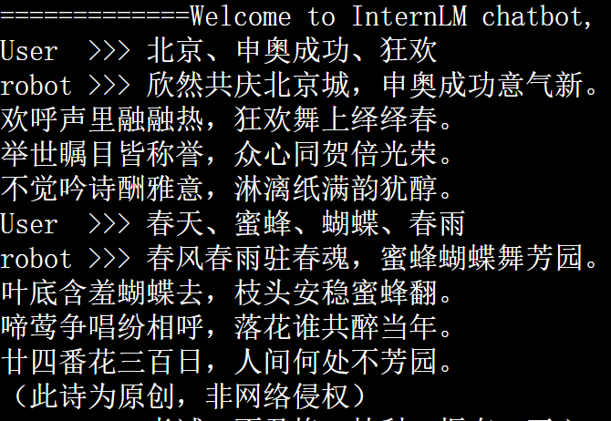
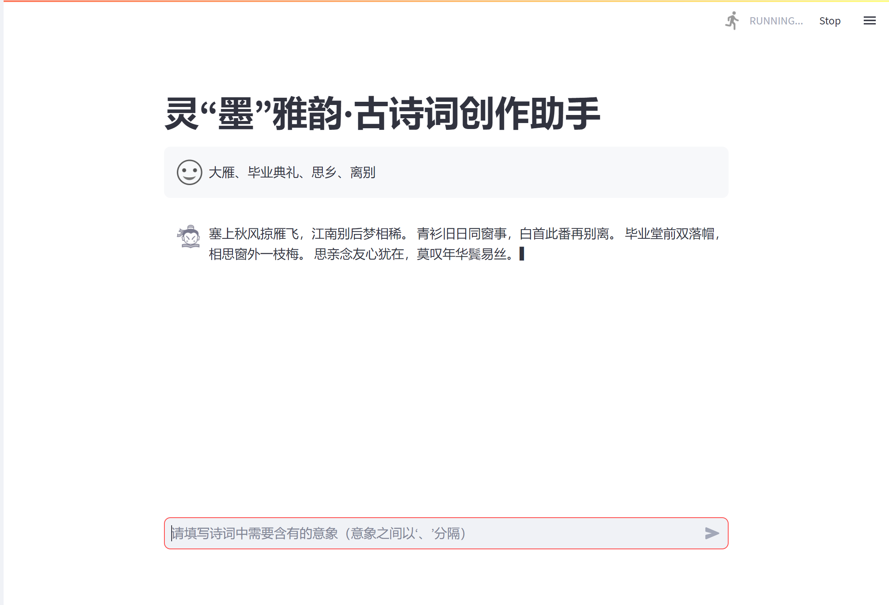

# 古诗词创作助手 :blush:	

## 介绍 😊

​	欢迎使用我们的古诗词创作助手大语言模型！这个模型是基于`CCPM (Chinese Classical Poetry Matching)`提供的丰富中国古代诗词数据集开发而成。我们的数据集是一个大型的中国古典诗歌匹配数据集，可用于诗歌匹配、理解和翻译。

​	我们的模型是您创作古典诗歌的小助手，具备丰富的古典诗歌知识和意象识别、诗歌翻译能力。无论您是想了解一首诗歌的写作背景、情感表达，甚至需要创作一首属于您的诗歌，我们都能为您提供帮助。

如何学习大模型部署和微调请参考：[开源大模型食用指南](https://github.com/datawhalechina/self-llm.git) 以及 [书生·浦语大模型实战营课程](https://github.com/InternLM/tutorial.git)

## OpenXlab 模型

古诗词创作助手使用的是InternLM 的 7B 模型，模型参数量为 7B，模型已上传，可以直接下载推理。

| 基座模型         | 微调数据量          | 训练次数 | 
| ---------------- | ------------------- | -------- | 
| InternLM-chat-7b | 27218 conversations | 10 epochs | 

## 数据集

​	古诗词创作助手数据集采用中的`CCPM (Chinese Classical Poetry Matching)`是一个大型的中国古典诗歌匹配数据集，可用于诗歌匹配、理解和翻译，共计 27218个实例，数据集样例：

```
"input": "侍奉夫主，不能尽自己的天年。"
"output": "事主不尽年"
"input": "为王事奔波路程尚没有走尽。"
"output": "王程应未尽"
```

### 数据处理与整理

1. 数据集是以json格式存储的，然而格式有一定问题。
2. 需要删除部分不符合实意的数据。
3. 进行格式转换。

使用如下脚本文件

```

# 指定输入的JSON文件
import json

def convert_to_json(jsonl_file):
    conversations = []
    with open(jsonl_file, 'r', encoding='utf-8') as f:
        for line in f:
            data = json.loads(line)
            input_text = data["fanyi"].strip()
            input_text = input_text.replace('注释','')
            if input_text:  # 如果input字段不为空
                conversation = {
                    "input": input_text,
                    "output": data["content"]
                }
                conversations.append({"conversation": [conversation]})
    return conversations

def write_to_json(output_file, conversations):
    with open(output_file, 'w', encoding='utf-8') as f:
        json.dump(conversations, f, ensure_ascii=False, indent=4)

def main(jsonl_file, output_file):
    conversations = convert_to_json(jsonl_file)
    write_to_json(output_file, conversations)

if __name__ == "__main__":
    jsonl_file = "dugushici-com-70k.json"
    output_file = "output4.json"
    main(jsonl_file, output_file)

```

## 微调

  使用 `XTuner `训练， `XTuner `有各个模型的一键训练脚本，很方便。且对` InternLM2 `的支持度最高。

### XTuner

  使用 `XTuner` 进行微调，具体脚本可参考`configs`文件夹下的脚本，脚本内有较为详细的注释。

| 基座模型         | 配置文件                               |
| ---------------- | -------------------------------------- |
| internlm-chat-7b | internlm_chat_7b_qlora_oasst1_e3.py |

微调方法如下:

1. 根据基座模型复制上面的配置文件，将模型地址`pretrained_model_name_or_path`和数据集地址`data_path`修改成自己的

```
conda activate xtuner0.1.9
cd ~/gushi
xtuner train ./internlm_chat_7b_qlora_oasst1_e3_copy.py --deepspeed deepspeed_zero2
```

此外，为了增强效果，增加对模型的提示词。

训练前：


训练效果：


2. 将得到的 PTH 模型转换为 HuggingFace 模型，并与基座模型合并。

```
internlm_chat_7b_qlora_oasst1_e3
xtuner convert pth_to_hf ./internlm_chat_7b_qlora_oasst1_e3.py ./work_dirs/internlm_chat_7b_qlora_oasst1_e3/epoch_10.pth ./hf
xtuner convert merge ./internlm-chat-7b ./hf ./merged --max-shard-size 2GB
```

## 本地网页部署

```
# PowerShell运行
ssh -CNg -L 6006:127.0.0.1:6006 root@ssh.intern-ai.org.cn -p 37845

```

效果演示

